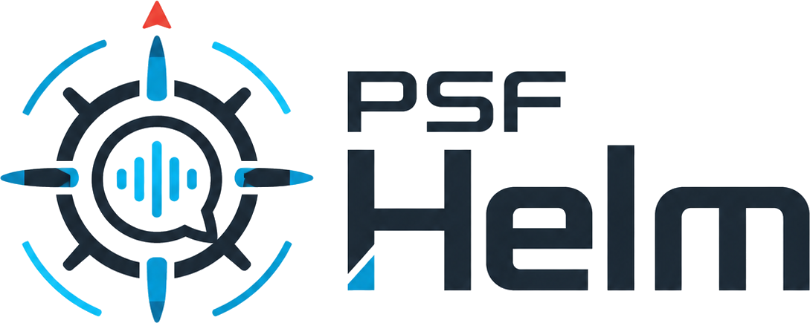

<div align="center">
  
  <p><em>Drive your robot truck — or fly your drone — with controls, or let an LLM drive it for you.</em></p>
</div>

PSF Helm is a local-first desktop app for controlling robots and drones from your computer — with a live camera feed, direct controls, and an optional layer that lets a local or frontier LLM drive the vehicle for you. You stay in charge of how much autonomy to hand off; the app works fully without ever invoking an LLM at all.

Three ways to fly, pick whichever fits the moment:

1. **Drive it yourself** — click the D-pad, push the keyboard, or grab a game controller. The Drive tab shows the camera, an always-visible STOP, the live state of the vehicle, and an activity log.
2. **Plan a command from English** — Helm's private local LLM (Ollama, isolated) turns "go forward 2 seconds, then turn left" into wire commands. The model runs on your machine; no account, no cloud.
3. **Hand the wheel to an LLM Captain** — the CLI is agent-first by design (structured JSON in, structured JSON out, paired snapshot+telemetry on every grab), so a local Ollama model *or* a frontier coding CLI (Claude, ChatGPT, Gemini, Grok) can drive the robot turn-by-turn from a terminal. The recipe is in [How to actually hand the wheel to a frontier model](#how-to-actually-hand-the-wheel-to-a-frontier-model) below.

The firmware runs on your own microcontroller, the camera stream stays on your LAN, and inference runs on your machine (or under your account at a frontier vendor — your call). Nothing transits the cloud unless you ask it to.

## Quick start

> **Heads up on platform support.** Linux x64 is what currently works end-to-end and is the only platform tested by the maintainer. macOS and Windows *should* work — Electron, Node, npm, and arduino-cli all ship first-class native builds for both — but Helm's installer scripts haven't been verified there recently. You may hit a rough edge; please [file an issue](https://github.com/hfsc2004/helm/issues) if you do.

Pick your platform:

- [Linux](#linux)
- [macOS](#macos)
- [Windows](#windows)

---

### Linux

**1. Install the prerequisites.** Helm needs `git`, Node.js LTS (22.x or newer), `npm`, and Python 3. On Debian/Ubuntu:

```bash
sudo apt update
sudo apt install git python3 python3-pip
```

For Node + npm, the version in `apt` is usually too old — install the current LTS via the [NodeSource setup script](https://github.com/nodesource/distributions):

```bash
curl -fsSL https://deb.nodesource.com/setup_22.x | sudo -E bash -
sudo apt install nodejs
```

On Fedora/RHEL: `sudo dnf install git python3 nodejs npm`. On Arch: `sudo pacman -S git python nodejs npm`. Verify with `node --version` — you want `v22.x` or higher.

**2. Go to your home folder and clone the repository there.** A terminal opens in your home folder by default, so this is usually just:

```bash
cd ~
git clone https://github.com/hfsc2004/helm.git
```

This creates a new folder called `helm/` inside your home folder (so the project now lives at `~/helm`).

**3. Move into the project folder.** From this point on, *every* command in this README expects you to be inside this folder.

```bash
cd helm
```

Run `pwd` to confirm — it should print something ending in `/helm`. Run `ls` and you should see folders like `core/`, `cli/`, `src/`, `firmware/`, and a `package.json` file.

**4. Run the one-time installer.** Installs Node deps and native modules. Takes a few minutes.

```bash
./install/RUN_ONCE_MAC_LINUX.sh
```

You only run this once per checkout. If it fails, the error message at the end tells you what to fix (usually a missing system package).

**5. Launch the desktop app.**

```bash
./start.sh
```

Helm-UI should open within a few seconds. Skip ahead to [Using Helm](#using-helm) below.

---

### macOS

> Tested less recently than Linux. The installer is written to handle the macOS path but you may hit something the maintainer hasn't seen yet — please [file an issue](https://github.com/hfsc2004/helm/issues) if you do.

**1. Install the prerequisites.** Easiest path is via [Homebrew](https://brew.sh):

```bash
# Install Homebrew first, if you don't have it (one-liner from brew.sh).
brew install git node python3
```

Verify with `node --version` — you want `v22.x` or higher. If `brew` installs an older Node, run `brew install node@22 && brew link --overwrite node@22`.

**2. Go to your home folder and clone the repository there.** A new Terminal opens in your home folder by default, so this is usually just:

```bash
cd ~
git clone https://github.com/hfsc2004/helm.git
```

This creates a new folder called `helm/` inside your home folder (so the project now lives at `~/helm`).

**3. Move into the project folder.** From this point on, *every* command in this README expects you to be inside this folder.

```bash
cd helm
```

Run `pwd` to confirm — it should end in `/helm`. Run `ls` and you should see folders like `core/`, `cli/`, `src/`, `firmware/`, and a `package.json` file.

**4. Run the one-time installer.**

```bash
./install/RUN_ONCE_MAC_LINUX.sh
```

**5. Launch the desktop app.**

```bash
./start.sh
```

If macOS refuses to launch Electron the first time with a "cannot be opened because the developer cannot be verified" message, right-click the app in Finder and choose **Open** — that's a one-time approval. Skip ahead to [Using Helm](#using-helm).

---

### Windows

> Helm ships a native Windows installer (`install/RUN_ONCE_WINDOWS.bat`). Electron, Node, npm, and arduino-cli all have first-class Windows builds, so the app runs natively — no WSL, no virtual machine. That said, the maintainer hasn't tested this path recently, so please [file an issue](https://github.com/hfsc2004/helm/issues) if you hit something rough.

**1. Install the prerequisites.**

- **Git for Windows** — [git-scm.com/download/win](https://git-scm.com/download/win). The installer adds `git` to your `PATH`; accept the defaults.
- **Node.js LTS (22.x or newer)** — [nodejs.org](https://nodejs.org/). Pick the LTS installer; it includes `npm`.
- **Python 3** — from the Microsoft Store (search "Python") or [python.org](https://www.python.org/downloads/windows/). Check **"Add python.exe to PATH"** in the installer if you use python.org.

Verify by opening a fresh Command Prompt or PowerShell and running:

```cmd
git --version
node --version
npm --version
python --version
```

`node --version` should report `v22.x` or higher.

**2. Open Command Prompt (or PowerShell) and go to your home folder.** PowerShell/cmd open in your user folder by default, so this is usually just:

```cmd
cd %USERPROFILE%
```

**3. Clone the repository there.**

```cmd
git clone https://github.com/hfsc2004/helm.git
```

This creates a new folder called `helm` inside your user folder (so the project now lives at `C:\Users\<your-name>\helm`).

**4. Move into the project folder.** From this point on, *every* command in this README expects you to be inside this folder.

```cmd
cd helm
```

Run `cd` with no arguments to confirm — it should print something ending in `\helm`. Run `dir` and you should see folders like `core`, `cli`, `src`, `firmware`, and a `package.json` file.

**5. Run the one-time installer.**

```cmd
install\RUN_ONCE_WINDOWS.bat
```

Installs Node deps. Takes a few minutes. You only run this once per checkout.

**6. Launch the desktop app.**

```cmd
start.bat
```

Or just double-click `start.bat` in Explorer. Helm-UI should open within a few seconds. Skip ahead to [Using Helm](#using-helm) below.

**Notes for Windows users:**

- **USB devices for firmware flashing** work natively — the ESP32 and Pi Pico boards show up under `COM3`, `COM4`, etc. in Device Manager. Helm's Devices tab enumerates them the same way it does `/dev/ttyUSB0` on Linux. You may need the [Silicon Labs CP210x driver](https://www.silabs.com/developers/usb-to-uart-bridge-vcp-drivers) or [CH340 driver](https://www.wch-ic.com/downloads/CH341SER_EXE.html) for some ESP32 dev boards if Windows doesn't auto-install them.
- **mDNS (`<name>.local`)** requires the [Bonjour Print Services for Windows](https://support.apple.com/kb/DL999) runtime. Without it, fall back to the vehicle's static IP (visible in `helm vehicle-list` and the Vehicles tab).
- **PowerShell vs Command Prompt**: either works. If a command in this README starts with `./` (Linux-style), use `.\` (backslash) on Windows.

---

### Using Helm

Once the desktop app is running:

- Go to the **Devices** tab to flash a board, or the **Vehicles** tab to register one that's already configured.
- Use the **Drive** tab to control a registered vehicle.

Or use the CLI instead — same code, different surface. From the `helm/` folder:

```bash
npm run helm -- describe        # full machine-readable command schema
npm run helm -- version         # what version you're on
npm run helm -- vehicle-list    # what vehicles you've registered
```

The CLI is also what an LLM Captain uses (see [How to actually hand the wheel to a frontier model](#how-to-actually-hand-the-wheel-to-a-frontier-model)).

## Two surfaces, one core

PSF Helm exposes the same logic two ways:

- **`helm-ui`** — Electron desktop app. Three tabs: **Drive** (camera, STOP, intent bar, input pad, speed slider, live state, activity log), **Vehicles** (per-vehicle cards with drive-tuning panel and sidecar config), and **Devices** (driver-input picker, USB/serial enumeration, GPU info, Ollama status). Launch with `./start.sh` or `npm run helm-ui`.
- **`helm`** — CLI. Agent-first by design: structured JSON output by default, NDJSON event streams, distinct exit codes, `helm describe` emits the full command schema for LLM introspection. Every UI control has a matching CLI command. The same `vehicle-snapshot` an LLM Captain uses to see the world is the same one a human runs at the terminal. Run with `npm run helm -- <command>`.

Both surfaces consume `core/` — neither owns business logic. A frontier model with shell access can drive Helm exactly the way a human or the desktop app can.

## End-to-end: drive a truck by talking to it

```bash
# 1. Register the truck — drive board by mDNS name (works with DHCP),
#    camera board by IP for now. If you flashed via the Devices wizard,
#    this is already done — skip to step 2.
npm run helm -- vehicle-add truck.local --name truck-01
ID=$(npm run helm -- vehicle-list | jq -r '.vehicles[0].id')
npm run helm -- vehicle-camera-set $ID http://172.20.0.16:81

# 2. Install + start Helm's private Ollama (port 52450, isolated from any system Ollama)
npm run helm -- ollama-install --confirm
npm run helm -- ollama-start

# 3. Download the default vision model (any .gguf works; this is the recommended one)
npm run helm -- model-download \
  https://huggingface.co/unsloth/Qwen2.5-VL-7B-Instruct-GGUF/resolve/main/Qwen2.5-VL-7B-Instruct-Q4_K_M.gguf \
  --name qwen2.5-vl-7b

# 4. Drive
npm run helm -- drive truck-01 "go forward 2 seconds"
npm run helm -- drive truck-01 "turn left then stop"

# Or drive directly (no LLM)
npm run helm -- cmd truck-01 fwd --speed 160 --ms 2000
npm run helm -- stop truck-01

# Live state stream
npm run helm -- state truck-01 --follow
```

Or do all of that from the desktop app — Add Vehicle includes an optional "Video board (ESP32-S3)" section that wires the camera at create time.

## What lives where

```
core/
  bmoc/             process + IPC-subscription lifecycle authority
  vehicles/         per-vehicle adapters + registry; ground-skidsteer adapter today
  llm/              private Ollama isolation, planner, prompts
  download/         HF-aware model downloader + GGUF wrap-for-Ollama
  hardware/         GPU detection (NVIDIA headless-first selection, Apple Silicon, etc.)
  serial/           USB / serial enumeration with board hints (pico, esp32, ...)
  toolchains/       arduino-cli + mpremote install + isolated env
  firmware-flash/   sketch template loader, validator, compile + upload
  voice/            optional whisper.cpp + piper engines (scaffolded; install pending)
  storage/          centralized disk-write caps; nothing on disk grows unbounded
  paths.ts          OS-appropriate data + config dirs
  privacy.ts        machine-readable privacy posture; powers `helm privacy`
  schema.ts         introspectable command schema; powers `helm describe`
  secrets.ts        .env-backed token store (mode 0600)

cli/                helm CLI: commands as registered modules
                    (vehicle, vehicle-drive, vehicle-wifi, vehicle-flash-config,
                    vehicle-camera, vehicle-audio, flash, drive, state, ...)
electron/           Electron main process + preload + IPC handlers
src/                Svelte renderer
  components/       Numpad, Gamepad, SpeedSlider, CameraFeed, AudioFeed,
                    VehicleCard, AddVehicleDialog, IntentBar, ActivityLog, ...
  views/            DriverView, VehiclesView, DevicesView, ConfigureBoardView
  stores/           fleet, inputMode, driveSpeed, activity, devicesScreen, view
shared/             types used by every surface (vehicle contract, IPC channels, llm)
firmware/           ESP32 / microcontroller sketches
  ground-skidsteer/ drive-board firmware (current)
  templates/        templated sketches with {{var}} placeholders
    ground-skidsteer-esp32/  drive ESP32 + L298N
    video-esp32-s3/          ESP32-S3 camera streamer (3 pin profiles:
                             esp32s3_eye / ai_thinker_s3 / elegoo_s3)
  raw-from-core-ce/ unconverted PSF Core sketches awaiting templatization
install/            one-time dependency installers
public/             static assets (logo, etc.)
docs/               design notes, conversion-todo, mockups
```

Each non-trivial subsystem has its own `README.md` documenting its rules and design.

## Drive view

The Drive tab is what you use day-to-day:

- **Camera** — live MJPEG from the ESP32-S3 video board; nothing transits the cloud.
- **STOP** — always-visible; firmware-side deadman (800 ms) backs it up.
- **Input pad** — Numpad-style 3×3 grid that doubles as touch/click buttons. The keyboard half is gated by the input mode you picked in the Devices tab:
  - **Keyboard WASD** — W/A/S/D for cardinals, Q/E/Z/C for diagonals (all hold-drive). R = CW 180°. X = stop.
  - **Keyboard NumPad** — 8/4/2/6 for cardinals, 7/9/1/3 for diagonals. 5 = CW 180°. 0 = stop. Digit row 0–9 works too for laptops.
  - **Game Controller** — left stick (tank-mix, with deadzone). South button (A on Xbox / X on PS) = stop. North button (Y / △) = CW 180°.
- **Speed slider** — sets the PWM ceiling for fwd/rev/turn and the gamepad stick. `+`/`−` step by 10 (`=`/`-` keys, or the numpad `+`/`-`). Click the track or drag the thumb. Each vehicle seeds from its saved tuning so it starts at "its" speed.
- **Vehicle state** — left/right motor PWM, deadman age, Wi-Fi RSSI.
- **Activity log** — every intent, every wire-level command, every reject.

## Let an LLM drive the robot

`helm vehicle-snapshot <id>` is the workhorse command for LLM-driven operation. It pulls one JPEG frame from the camera **and** pairs it with the drive board's telemetry — IR distances on all four sensors, collision-guard state, motor PWM, RSSI — in a single response. An LLM Captain looking at a frame almost always wants to know whether the forward path is blocked *right now*, so we made that the default rather than a separate round-trip.

When Helm-UI is running, the standalone CLI snaps via the loopback control plane so **the live UI and the CLI share the same upstream connection to the camera** — the ESP32-S3 camera firmware only accepts one HTTP client at a time, so this is the only way to drive *and* observe simultaneously. The frontier model in a terminal sees the same frame you do.

```bash
# Write a JPEG to disk + emit structured handle (path, telemetry, guard state).
npm run helm -- vehicle-snapshot truck-01
# → { ok, path, bytes, contentType, source: "cache"|"direct", capturedAt,
#     telemetry: { ok, data: { irFrontCenter, guardForwardBlocked, ... } } }

# Or capture to a specific path.
npm run helm -- vehicle-snapshot truck-01 --out /tmp/frame.jpg

# Or get the bytes back as base64 for an agent-style consumer (LLM, pipeline).
npm run helm -- vehicle-snapshot truck-01 --base64

# Or pipe raw JPEG bytes to stdout (for shell composition).
npm run helm -- vehicle-snapshot truck-01 --stdout > frame.jpg

# Skip the paired telemetry fetch (humans browsing frames, scripts that don't care).
npm run helm -- vehicle-snapshot truck-01 --no-telemetry

# Force the direct /capture path (bypasses the running UI's cache).
npm run helm -- vehicle-snapshot truck-01 --no-bridge
```

A minimal LLM Captain loop is just:

```bash
# See the world, decide, act, repeat.
npm run helm -- vehicle-snapshot truck-01 --base64   # → frame + IR + guard, in JSON
npm run helm -- cmd truck-01 fwd --speed 160 --ms 800
npm run helm -- stop truck-01
```

That's the whole protocol. A frontier model with shell access can pilot the truck through three commands. The firmware's collision guard refuses unsafe commands with HTTP 409 instead of executing them, so a confused model can't drive through a wall — the worst it can do is get told "no" by the truck itself.

### How to actually hand the wheel to a frontier model

The "frontier model with shell access" above is not a metaphor. The official CLIs from Anthropic, OpenAI, Google, and xAI all ship coding agents that can run shell commands in your terminal. PSF Helm is designed so the agent-first CLI surface (`helm`) *is* the protocol — no special bridge, no MCP server, no API key configuration on Helm's side. The model uses the same commands a human would.

The recipe — works for any of: Claude Code (`claude`), OpenAI Codex CLI (`codex`), Gemini CLI (`gemini`), Grok CLI (`grok`):

1. **Have a working vehicle in Helm.** Open Helm-UI, flash a board via the Devices wizard (or run `helm flash` from the CLI), confirm the vehicle drives from the Drive tab. If you can drive it, the model can drive it. **Do not skip this step** — letting an LLM debug a misconfigured robot is a bad time.

2. **In terminal #1**, from the project directory, start your frontier coding CLI:

    ```bash
    cd /path/to/psf-helm
    claude                # or: codex / gemini / grok
    ```

    Ask it to read the project so it knows what tools are available:

    > "Read `AGENTS.md` (it's written specifically for you), then summarize back to me how you would drive the robot and what safety rules you'll follow."

    `AGENTS.md` is the LLM-facing operator manual — hard rules, the 3-command Captain loop, full telemetry interpretation, the IR-reading cheat sheet, and a catalog of every CLI command the model needs (`helm cmd`, `helm stop`, `helm vehicle-snapshot`, `helm state`, `helm describe`) in the priority order it should reach for them. It also documents the failure modes previous Captains have run into on this hardware, so the model doesn't have to learn them the hard way. Codex, Cursor, Claude Code, and Grok all auto-load `AGENTS.md` on session start, so the model has likely already read it before you even ask — confirming with a "summarize what you read" prompt is just a sanity check.

3. **In terminal #2**, from the same project directory, start Helm-UI:

    ```bash
    cd /path/to/psf-helm
    ./start.sh
    ```

    Helm-UI opens the loopback control plane so terminal #1's CLI commands share the camera connection with the live UI. You can watch the camera feed in the UI while the model drives — same frames, same connection.

4. **Back in terminal #1**, give the model a mission:

    > "The truck is online. Drive it forward a couple feet, then look around and tell me what you see."

    The model will issue `helm vehicle-snapshot truck-01 --base64`, look at the JPEG it gets back, check the IR/guard data, issue a `helm cmd` with a duration, snapshot again, and narrate what's happening. If something blocks it (collision guard fires, camera offline, vehicle not in registry), the structured error tells the model exactly what's wrong and it'll usually self-correct.

**Why two terminals and not one?** Helm-UI in terminal #2 keeps the long-lived camera stream open and renders it visually for you. The frontier coding CLI in terminal #1 runs short-lived commands that piggy-back on that stream via the loopback control plane. You stay in the loop visually while the model handles the cognition.

**Safety:** the firmware's 800ms deadman timer, the IR collision guard, and the always-on STOP button in Helm-UI all still apply. If the model does something dumb, the truck refuses the command, the deadman cuts the motors, or you hit STOP. The model never touches the firmware — only the high-level intents.

**Privacy:** the JPEGs and telemetry stay on your machine until *the model's CLI* sends them to the frontier vendor. That's the same trust boundary you accepted when you installed `claude` / `codex` / `gemini` / `grok` in the first place — Helm doesn't add a new one. If you want zero bytes leaving your machine, use a local Ollama model via `helm drive` instead.

The `source` field tells you where the frame came from:

| `source`  | Meaning |
|---|---|
| `cache`   | Pulled from the live MJPEG stream the UI is holding open. Fastest; same frame the UI sees. |
| `direct`  | The UI wasn't running, so the CLI hit the camera's `/capture` directly. |

The whole pipeline is local: the camera lives on your LAN, the cache lives in your Helm-UI process, the bridge between processes is loopback-only (`127.0.0.1`, bearer-token auth, descriptor in `<dataDir>/control-plane.json` mode `0600`). Nothing transits the cloud — including the bytes a frontier model sees when it asks for a snapshot.

## Vehicles tab

Per-vehicle cards. Each one shows endpoint, capabilities, and sidecars (camera / mic) with inline add/edit. Expand **Drive tuning** for the action map (rotate intents 90/180° to match a rotated chassis without re-flashing), the default speed, swap-sides, and invert-left/right. A `customized` badge appears when the vehicle has any tuning saved.

## Devices tab

Bench surface for inspecting and configuring hardware:

- **Driver input** — pick Keyboard WASD / Keyboard NumPad / Game Controller. Saved across restarts via localStorage. Gamepad detection is live while the tab is open.
- **USB / Serial** — live list of attached microcontrollers with friendly board hints (Raspberry Pi Pico, ESP32, etc.). Click a detected board to open the **Configure Board** wizard (see [Flashing firmware](#flashing-firmware) below).
- **Inference hardware** — detected GPUs with the headless-first NVIDIA selection (a P4 dedicated to inference wins over an M5000 driving the desktop, automatically).
- **LLM backend** — private Ollama install state, port, models dir, disk used.

## Flashing firmware

Helm flashes microcontrollers from the same Devices tab you use to inspect them. Plug a board in over USB, the **USB / Serial** section detects it, click **Configure →**, and the wizard walks you through it.

### From the UI

1. **Plug the board in.** Linux usually exposes it as `/dev/ttyUSB0` (CP210x / CH340 bridges) or `/dev/ttyACM0` (native USB-CDC, including ESP32-S3 and Pico 2). Helm tags it with a board hint chip (green = ESP32, purple = Pi Pico).
2. **Click Configure →.** Pick the template (auto-selected when only one matches the board kind).
3. **Vehicle name.** Becomes the mDNS hostname automatically — naming the truck `Truck` makes it reachable as `truck.local` after flash.
4. **Wi-Fi.** SSID dropdown shows what the host's radio can see, filtered to the bands the board can actually join. Eye-icon toggle on the password field so you can verify it before flashing it in. Networks on bands the target can't reach (e.g. 5GHz for a classic ESP32) are hidden with a "N networks hidden" note.
5. **Networking.** Static IP (default) or DHCP. With DHCP, Helm stores the vehicle's `transport.host` as `<name>.local` instead of an IP, so a new DHCP lease doesn't break the connection. Heads-up: mDNS needs Avahi (Linux) or Bonjour (Windows); on a guest Wi-Fi that blocks multicast, switch to Static IP.
6. **(Optional) Advanced.** Motor invert / trim. Per-board flash params (FQBN override, `--build-property` for USB-CDC and pin profile, erase-before-upload, post-upload serial capture) are exposed here too; the ESP32-S3 video template offers three pin profiles out of the box (`esp32s3_eye` / `ai_thinker_s3` / `elegoo_s3`).
7. **Click Flash.** First time on a host, arduino-cli auto-installs the ESP32 core (~5–10 min, one time). Compile + upload streams live below. On success, Helm updates the registry — re-flashing the same robot updates the existing record instead of erroring "vehicle already exists".

If the button is greyed out, a yellow `!` chip next to it names the missing field — no guessing which gate is closed.

### From the CLI

The same flow is driveable headless — useful for scripting and for the CI/agent path:

```bash
npm run helm -- toolchain-status              # what's available (arduino-cli, mpremote)
npm run helm -- flash-templates               # what we can program
npm run helm -- wifi-scan                     # what SSIDs the host's radio sees (Linux today)

# Render a template without flashing — sanity-check the variables
npm run helm -- flash-render --template ground-skidsteer-esp32 \
  --var "wifi.ssid=MyNet,wifi.password=secret,mdns.name=truck"

# Flash the drive board
npm run helm -- flash /dev/ttyUSB0 \
  --template ground-skidsteer-esp32 \
  --var "wifi.ssid=MyNet,wifi.password=secret,mdns.name=truck,wifi.useStatic=true,wifi.staticIp=172.20.0.15"

# Flash the camera board with the recommended Elegoo S3 profile
npm run helm -- flash /dev/ttyACM0 \
  --template video-esp32-s3 \
  --var "wifi.ssid=MyNet,wifi.password=secret,wifi.staticIp=172.20.0.16,camera.pinProfile=elegoo_s3" \
  --board video --erase --capture-runtime-serial-ms 20000
```

### After flash

Once the board reboots and joins Wi-Fi, the firmware exposes:

| Endpoint | What it does |
|---|---|
| `GET /health` | `{ok, mode, ip, gateway, subnet, port, mdns}` — confirm the board joined and learn its mDNS name |
| `GET /telemetry` | Motor state, deadman age, RSSI, IP, **four IR readings (`irFrontLeft` / `irFrontCenter` / `irFrontRight` / `irRear`)**, **guard state (`guardThreshold` / `guardForwardBlocked` / `guardReverseBlocked`)** |
| `GET /cmd?fwd=N` `&rev=N` `&turn=±N` `&left=N&right=N` `&stop=1` | Drive commands (the collision guard refuses `fwd` when the front-center IR is over threshold, and `rev` when the rear is; returns `409 {ok:false, blocked:"forward"\|"reverse"}`) |
| `GET /config/guard` | `{threshold, hysteresis}` — read current settings |
| `GET /config/guard?threshold=N` | Tune the collision-guard threshold at runtime; in-RAM only, resets on boot (re-flash to change the default) |

### Troubleshooting

- **"vehicle already exists"** — fixed; re-flashing the same name now reuses the existing registry record. If you see this on an older build, delete the record from the Vehicles tab and re-flash.
- **mDNS works once then times out** — known; the responder isn't re-announcing periodically yet. Fall back to the board's IP (from `/health`) until that's fixed.
- **Read from `/dev/ttyUSB0` stalls** — close Helm-UI (it competes with the bootloader for the serial port via background telemetry polls) and retry.
- **First flash takes 10+ minutes** — that's the one-time ESP32 core install. Subsequent flashes are ~30s.
- **Compile error: `'configured' does not name a type`** — fixed in the current template; was a dormant typo that only surfaced on the static-IP fallback path.

## Bring your own model

Any llama.cpp-compatible `.gguf` works. Drop the URL into `helm model-download` and Helm fetches it, verifies it, and registers it with the private Ollama via blob upload + Modelfile creation. HF token (for gated models) lives in `.env`, mode 0600, sent only to `huggingface.co` as Bearer auth, never echoed.

| Recommended starter | Size | Vision? | Gated? |
|---|---|---|---|
| [Qwen2.5-VL-7B-Instruct (Q4_K_M)](https://huggingface.co/unsloth/Qwen2.5-VL-7B-Instruct-GGUF/resolve/main/Qwen2.5-VL-7B-Instruct-Q4_K_M.gguf?download=true) | ~4.7 GB | Yes | No |
| [Gemma 3 4B Instruct (Q4_0 QAT)](https://huggingface.co/google/gemma-3-4b-it-qat-q4_0-gguf/resolve/main/gemma-3-4b-it-q4_0.gguf?download=true) | ~3 GB | Yes | Yes (HF account + Gemma TOS) |

Both are vision-capable (the agent will eventually be able to see the camera feed). Vision is idle until wired into the planner — costs nothing today.

## Supported vehicles

| Vehicle | Status |
|---|---|
| ESP32 skid-steer ground robot (HTTP/WiFi) | Driving end-to-end |
| Drive board with **4× Sharp IR distance sensors + collision guard** (front L/C/R + rear) | In production firmware |
| ESP32-S3 camera sidecar (PSF-original streamer; 3 pin profiles) | Flash-ready, live MJPEG into Drive view |
| Dual-board truck (drive ESP32 + ESP32-S3 video, separate IPs, mDNS) | Driving end-to-end |
| Roving microphone sidecar | Vehicle streams I2S mic to host, host-side playback |
| ESP32-S3 + Pico 2 quadcopter (with SNN/STDP flight control) | Planned |

## Design principles

- **Local-first.** No cloud accounts. No analytics. Your robot, your laptop, your network. The few opt-in outbound destinations are documented below.
- **Two surfaces over one core.** The CLI and the UI are peers. Either can do anything the other can.
- **Vehicle-neutral.** Ground robots first; drones and other vehicles slot in by adding a `core/vehicles/<kind>.ts` adapter and a `target` value, not by rewriting anything.
- **Safety by default.** Firmware deadman timer (800 ms on the truck), strict app-side command bounds, always-visible STOP. Validators reject malformed model output rather than guessing at it.
- **One authority for child processes.** Everything Helm spawns (Ollama, arduino-cli, mpremote, future voice engines, flash subprocesses) registers with BMOC. App-quit reaps every child. No orphans.
- **One authority for IPC subscriptions.** Long-lived streams (state, drive lifecycle) are sessions too. Window-close reaps them.
- **Bring your own model.** Any `.gguf`. No vendor lock-in.
- **Cap everything on disk.** No category of stored data grows unbounded.

## Requirements

- Node.js LTS (22.x or newer recommended)
- Linux x64 today; macOS and Windows in the next round of polish
- For the Drive view: a vehicle on your local WiFi (the ESP32 truck firmware is in `firmware/ground-skidsteer/`)
- For the planner: any HF-hosted `.gguf` model (Qwen2.5-VL-7B recommended)
- For the Devices flash flow: arduino-cli (Helm installs it on demand) for ESP32 / ESP32-S3; Python 3 + `pip install mpremote` for Pi Pico / Pico 2

## Status

Working end-to-end on Linux x64:

- ✅ Drive an ESP32 skid-steer truck over WiFi (CLI and UI)
- ✅ **Dual-board vehicles**: separate drive ESP32 + ESP32-S3 camera-and-video board, each with its own IP, Wi-Fi credentials, static-IP block, and flash params — mirrors the PSF Core Relay "Gateway Card" shape
- ✅ **Configure-and-flash from the UI**: click a detected board → pick a template → fill in Wi-Fi / camera params → flash with live arduino-cli output
- ✅ **mDNS discovery** — drive boards advertise as `<name>.local` so DHCP IP changes don't break the connection; the host-side HTTP layer translates `ENOTFOUND` on `.local` names into "install Avahi (Linux) or Bonjour (Windows)" instead of a raw DNS error
- ✅ **Host-side Wi-Fi scan** in the flash wizard — SSID dropdown lists networks the host sees (Linux/`nmcli` today, macOS/Windows fall back to text input), filtered to the bands the target board's radio can actually join (no 5GHz networks offered for an ESP32)
- ✅ **Flash wizard polish** — yellow `!` chip names the missing field instead of silently disabling the Flash button; password reveal eye-icon so the user can verify a Wi-Fi typo *before* it gets baked into firmware; re-flashing the same robot updates the existing registry entry instead of erroring with "vehicle already exists"
- ✅ **Auto-heal partial ESP32 core installs** — when arduino-cli's compile errors look like a corrupted platform install, Helm reinstalls the core and retries automatically; first-run failures get a one-line user-actionable cause (network / disk / permissions) instead of raw `ECONNREFUSED`
- ✅ **Drive-tuning panel** per vehicle: action map (rotate intents 90/180° without re-flashing), swap-sides, invert-left/right
- ✅ **Three input devices** for driving: Keyboard WASD (with QEZC diagonals), Keyboard NumPad (8/4/2/6 + 7/9/1/3), or Game Controller (left-stick tank mix); pick from the Devices tab
- ✅ **Drive-speed slider** on the Drive view with +/- step buttons and keyboard shortcuts; live during a held drive
- ✅ **Four IR distance sensors on the drive board** — Sharp GP2Y0A21s buffered through per-channel LM358s onto ADC1 GPIOs 34/32/33/35 (front-left at 45°W, front-center, front-right at 45°E, rear). Published as raw ADC counts on `/telemetry`; voltage→distance conversion stays host-side so the curve is hot-reloadable
- ✅ **Collision guard** — firmware refuses `fwd` when the front-center IR exceeds the threshold and refuses `rev` when the rear IR does. Turns and stops always pass (escape hatch from a pinned position). Default ~2-3cm trigger; tunable at runtime via `GET /config/guard?threshold=N` — no re-flash needed
- ✅ Plan commands from natural language via a local LLM (Ollama, isolated)
- ✅ Download HF models with HF-token support, register them with Ollama
- ✅ Detect USB/serial devices (Pi Pico, Pico 2, ESP32, ESP32-S3) and host GPUs
- ✅ Manage the arduino-cli + mpremote toolchains
- ✅ Compile + upload sketch templates with strict variable validation (ground-skidsteer ESP32 + ESP32-S3 video camera)
- ✅ MJPEG camera sidecar — vehicle's S3 streams `/stream` / `/capture` / `/health` directly to the Drive view; nothing transits the cloud
- ✅ Shared camera-stream cache — one upstream connection per vehicle; the live UI and `helm vehicle-snapshot` see the same frames. Works around single-threaded ESP32 camera firmwares (which can only serve one HTTP client at a time)
- ✅ Loopback control plane on 127.0.0.1 — running Helm-UI exposes a token-authed local-only HTTP surface so the standalone `helm` CLI (and, eventually, an LLM agent) can siphon frames out of the live cache without fighting the camera for a connection
- ✅ Roving microphone sidecar — vehicle audio over chunked HTTP, played host-side
- 🚧 In progress: Pico/mpremote flash backend, voice install/runtime, native gamepad button remap, packaging, macOS/Windows ports

Cross-platform target is Linux, macOS, and Windows. Linux x64 is what currently works end-to-end.

## License

Apache-2.0 (planned). See `LICENSE`.

## What PSF Helm does NOT do

Nothing in PSF Helm phones home. No analytics, no error reporting, no user tracking, no cloud accounts. Vehicle state ("telemetry" in robotics terminology) refers to data the *vehicle* reports about itself — battery voltage, motor speed, signal strength, IR distances, camera frames — and Helm itself never transmits any of it off your machine. (If you choose to run a frontier coding CLI in the recipe above, that CLI is the thing that sends bytes upstream — to a vendor *you* picked. Helm is not in that path.) 🐤

Voice (when implemented) will run locally via whisper.cpp + piper. Audio is never transmitted; transcription happens on your machine and the audio is discarded after the command runs. 🐤

Helm makes outbound network connections only to opt-in destinations, only when you trigger them. The current list (also available as JSON via `helm privacy`):

| Host | Purpose | Triggered by |
|---|---|---|
| `ollama.com` | Helm's private Ollama binary install | `helm ollama-install --confirm` |
| `github.com` | Voice engine binaries (when voice ships) | `helm voice-install --confirm` |
| `huggingface.co` | Model `.gguf` downloads (HF token sent only here, only as Bearer auth) | `helm model-download <url>` |
| `downloads.arduino.cc` | arduino-cli toolchain install | `helm toolchain-install --target arduino-cli --confirm` |

If a future version ever adds any other outbound network traffic, it will be opt-in and documented prominently. 🐤

Helm does also bind one **loopback-only** listener: when Helm-UI is running, it exposes a tiny HTTP control plane on `127.0.0.1` (ephemeral port, bearer-token authenticated, descriptor written to `<dataDir>/control-plane.json` mode `0600`). This is how the standalone `helm` CLI shares the camera cache with the live UI. Nothing on the LAN can reach it; nothing leaves your machine.

---

<sub>Copyright © 2026 Pseudo Science Fiction</sub>
